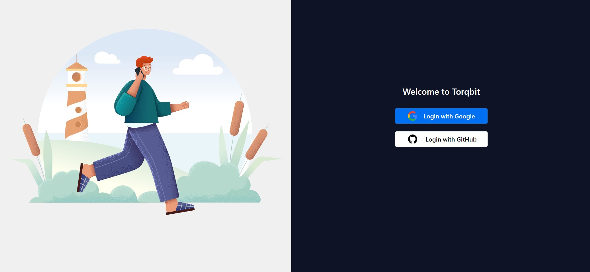
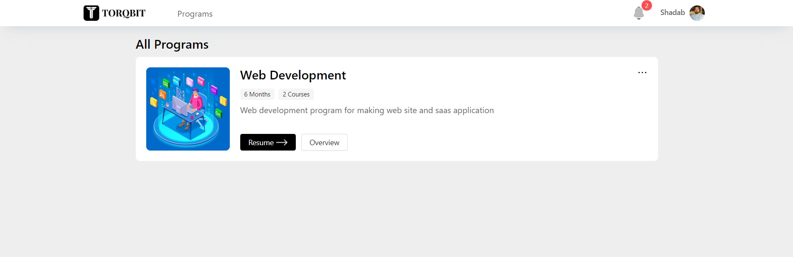

<br /><br />

<p align="center">
<a href="https://plane.so">
  
</a>
</p>

<!-- <h3 align="center"><b>Torqbit</b></h3> -->
<p align="center"><b>An Open Source Online learning platform.</b></p>

<p align="center">
<a href="https://discord.gg/kKR9TWm7">

</a>

</p>

<p>
    <a href="https://dev.torqbit.com/login" target="_blank">
      
    </a>
    <a href="https://dev.torqbit.com/" target="_blank">
      
    </a>
</p>

Meet [Torqbit](https://dev.torqbit.com). An open-source learning platform to manage your classess 🧘‍♀️.

> Torqbit is still in its early days, not everything will be perfect yet, and hiccups may happen. Please let us know of any suggestions, ideas, or bugs that you encounter on our [Discord](https://discord.gg/kKR9TWm7) or GitHub issues, and we will use your feedback to improve on our upcoming releases.

The easiest way to get started with Torqbit is by installing in your local machine. Torqbit offers to add Course, Update and Tracking the learning progress.

## ⚡️ Contributors Quick Start

### Prerequisite

Development system must have docker engine installed and running.

### Steps

Setting up local environment is extremely easy and straight forward. Follow the below step and you will be ready to contribute

1. Clone the code locally using `git clone https://github.com/torqbit/console`
1. Switch to the code folder `cd console`
1. Create your feature or fix branch you plan to work on using `git checkout -b <feature-branch-name>`
1. Open the code on VSCode or similar equivalent IDE
1. Review the `.env` files available in various folders. Visit [Environment Setup](./ENV_SETUP.md) to know about various environment variables used in system
1. Run the docker command to initiate various services `docker compose -f docker-compose-local.yml up -d`

You are ready to make changes to the code. Do not forget to refresh the browser (in case id does not auto-reload)

Thats it!

## 🍙 Self Hosting

For self hosting environment setup, visit the [Self Hosting](https://docs.plane.so/docker-compose) documentation page

## 🚀 Features

- **Ownborading User**: Onboard users seamlessly with intuitive registration and profile setup, ensuring a smooth entry into the learning platform.
- **Tracking User**: Track user engagement and progress comprehensively, providing insights into individual learning journeys and performance metrics.
- **Adding Courses**: Easily add new courses to the platform, enriching the learning catalog with diverse and relevant content.
- **Updating Courses**:Keep courses up-to-date with timely updates and revisions, ensuring learners access the most current information and resources
- **Tracking Learning Progress**: Monitor learning progress with detailed analytics, enabling learners and instructors to assess skill development and mastery.
- **Giving Certificate**: Reward completion and achievement with personalized certificates, validating learners' efforts and accomplishments.
- **Course Discussion**: Foster collaboration and engagement through course-specific discussion forums, facilitating knowledge sharing and peer interaction.
- **Alert Comment Notification**: Enable timely communication by alerting users to new comments and notifications, fostering active participation and community engagement.

## 📸 Screenshots

## ImageKit DB Documentation

## Introduction

ImageKit DB is a cloud-based image storage and management solution that provides seamless integration with your application.

## Installation

To install ImageKit DB, follow these steps:

1. Sign up for an account on the ImageKit DB website.
2. Obtain your API keys from the dashboard.
3. Install the ImageKit DB SDK using npm or yarn:

### Getting Started

First need to add .env file with some credentials:

```bash
# Next ENV
NODE_ENV = development
NEXT_PUBLIC_SECRET
NEXTAUTH_URL
JWT_SECRET

# DB Credentials
DATABASE_URL

#  ImageKit db Credentials
IKIT_PUBLIC_KEY
IKIT_PRIVATE_KEY
IKIT_URL_ENDPOINT
IKIT_AUTH_ENDPOINT
IKIT_PDF_DIRECTORY

# Google Auth Credentials
GOOGLE_ID
GOOGLE_SECRET

# GitHub Auth Credentials
GITHUB_ID
GITHUB_SECRET

# SMTP Email Credentials
NEXT_SMTP_HOST
NEXT_SMTP_USER
NEXT_SMTP_PASSWORD
FROM_SMTP_USER_EMAIL

```

### Installing Packages

Using npm:

```bash
$ npm install
```

Using yarn:

```bash
$ yarn install
```

Then, you can run locally in development mode with live reload:

Using npm:

```bash
$ npm dev
```

Using yarn:

```bash
$ yarn dev
```

## 📚Documentation

For full documentation, visit [docs.plane.so](https://docs.plane.so/)

To see how to Contribute, visit [here](https://github.com/makeplane/plane/blob/master/CONTRIBUTING.md).

## ❤️ Community

The Torqbit community can be found on GitHub Discussions, where you can ask questions, voice ideas, and share your projects.

To chat with other community members you can join the [Torqbit Discord](https://discord.gg/kKR9TWm7).

Our [Code of Conduct](https://github.com/torqbit/console) applies to all Torqbit community channels.

## ⛓️ Security

If you believe you have found a security vulnerability in Torqbit, we encourage you to responsibly disclose this and not open a public issue. We will investigate all legitimate reports. Email info@torqbit.com to disclose any security vulnerabilities.
